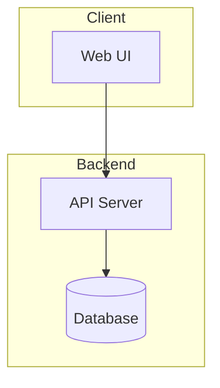
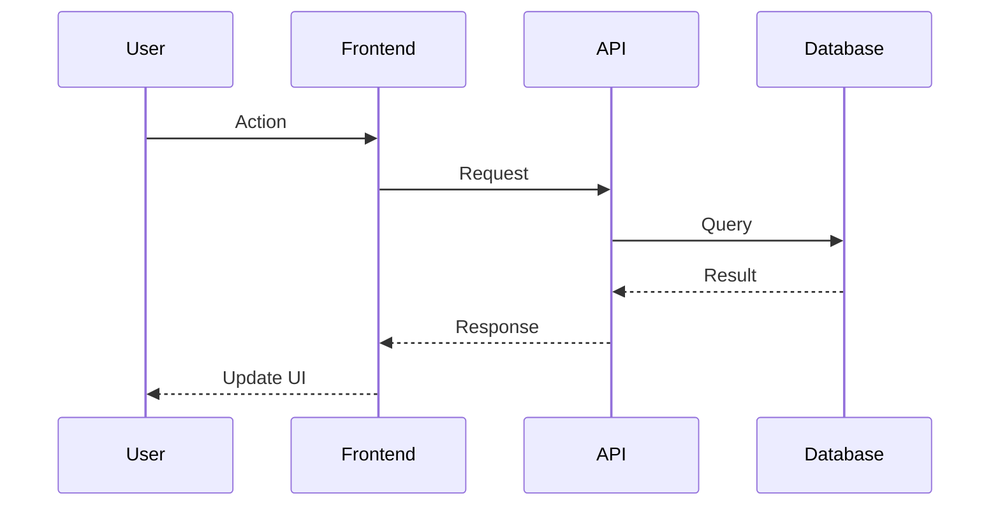

# Architecture

## Overview

TODO: Add description

## System Diagram



## Tech Stack

| Layer | Technology |
|-------|------------|
| Frontend | TODO |
| Backend | TODO |
| Database | Supabase (PostgreSQL) |
| Deployment | Vercel |

## Data Flow



## Directory Structure

```
TODO
```

## Key Components

### TODO
- Purpose: 
- Location: 
- Dependencies: 

### TODO
- Purpose: 
- Location: 
- Dependencies: 

## API Endpoints

| Method | Endpoint | Description |
|--------|----------|-------------|
|  |

## Environment Variables

| Variable | Description | Required |
|----------|-------------|----------|
|  |

## Security Considerations

- TODO

## Performance Considerations

- TODO
